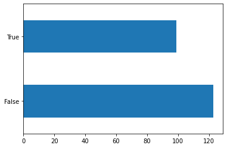
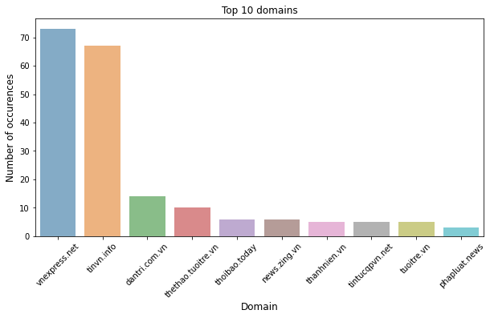
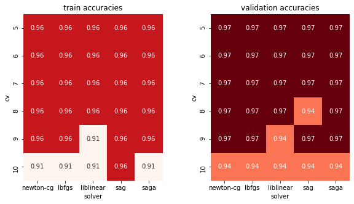
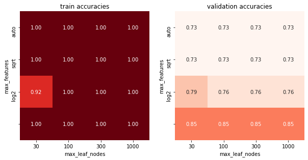
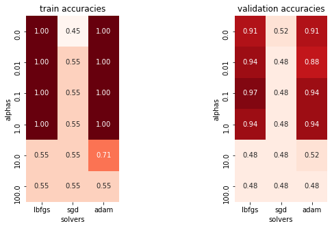

<center><b><font size="+3">FAKE NEW DETECTION</font></b></center>

<center>
    
</center>

# Link web test

Link test được deploy trên nền tảng `streamlit` do thầy cô gợi ý. Link [tai đây](https://share.streamlit.io/lavdata/fake_new_detector/main/pr.py)

---

# Thông tin thành viên và phân công nhiệm vụ

|MSSV    | HO TEN        | NHIEM VU    |
|:-------|:--------------|:-----------:|
|...| Phạm Thành Đạt| Tiền xử lí, EDA. Hỗ trợ, nhận xét phần 3, 4       |
|...| Trần Bảo Tín  | Tiền xử lí, EDA. Hỗ trợ, nhận xét phần 3, 4   |
|19120724| Lê Anh Vũ     | Mô hình hóa, Deploy model. Hỗ trợ, nhận xét phần 1, 2 |
|...| Nguyễn Phú Thụ| Mô hình hóa, Deploy model. Hỗ trợ, nhận xét phần 1, 2|

# Import các thư viện cần thiết


```python
import string
import numpy as np
import pandas as pd
import seaborn as sns
import matplotlib.pyplot as plt
from joblib import dump, load
from sklearn.metrics import accuracy_score
from sklearn.tree import DecisionTreeClassifier
from sklearn.neural_network import MLPClassifier
from sklearn.model_selection import cross_val_score
from sklearn.model_selection import train_test_split
from sklearn.linear_model import LogisticRegressionCV
from sklearn.feature_extraction.text import TfidfVectorizer

# Thư viện ngoài
from pyvi import ViTokenizer
```

`pyvi` là thư viện ngoài. Em dùng để `Tokenizer` văn bản tiếng việt. Thầy cô chỉ cần cài bằng cách `pip install pyvi`. Thông tin chi tiết [tại đây](https://towardsdatascience.com/introduction-to-pyvi-python-vietnamese-nlp-toolkit-ff5124983dc2)

# Nguồn dữ liệu

File `vn_news_223_tdlfr.csv` được lấy từ [VNFD Dataset](https://github.com/thanhhocse96/vfnd-vietnamese-fake-news-datasets/blob/master/CSV/vn_news_223_tdlfr.csv)
- Tập dữ liệu 223 record bản tin tiếng Việt, gồm 2 nhãn: 1 (tin giả) và 0 (tin thật) 
- Mô tả dữ liệu: được lấy từ [VNFD](https://github.com/thanhhocse96/vfnd-vietnamese-fake-news-datasets/tree/master/CSV)

File `vietnamese-stopwords.txt` chứa các từ `stopword` được lấy từ [VNStopword](https://github.com/stopwords/vietnamese-stopwords/blob/master/vietnamese-stopwords.txt)

# Tiền xử lý văn bản tiếng Việt

Dữ liệu được lấy từ file `vn_news_223_tdlfr.csv`


```python
news_df = pd.read_csv('vn_news_223_tdlfr.csv', encoding='utf-8')
news_df.sample(5)
```


<div>
<style scoped>
    .dataframe tbody tr th:only-of-type {
        vertical-align: middle;
    }

    .dataframe tbody tr th {
        vertical-align: top;
    }

    .dataframe thead th {
        text-align: right;
    }
</style>
<table border="1" class="dataframe">
  <thead>
    <tr style="text-align: right;">
      <th></th>
      <th>text</th>
      <th>domain</th>
      <th>label</th>
    </tr>
  </thead>
  <tbody>
    <tr>
      <th>196</th>
      <td>Trung Quốc hủy nhiều chuyến bay tới Thường Châ...</td>
      <td>vnexpress.net</td>
      <td>0</td>
    </tr>
    <tr>
      <th>67</th>
      <td>Mặc đồ không khác gì vải màn lên bar đú đởn, M...</td>
      <td>tinvn.info</td>
      <td>1</td>
    </tr>
    <tr>
      <th>81</th>
      <td>Nếu thấy thứ này thò lên ngoài vườn nhà, đừng ...</td>
      <td>tinvn.info</td>
      <td>1</td>
    </tr>
    <tr>
      <th>121</th>
      <td>Người đàn ông chết khô ở máy dập có thể do đột...</td>
      <td>tuoitre.vn</td>
      <td>0</td>
    </tr>
    <tr>
      <th>141</th>
      <td>Ôtô 'chôn chân' vì bị chặn đầu bởi trăm xe máy...</td>
      <td>vnexpress.net</td>
      <td>0</td>
    </tr>
  </tbody>
</table>
</div>


## Dữ liệu có bị trùng lặp hay không? Nếu có thì loại bỏ chúng


```python
len(news_df) - len(news_df.drop_duplicates())
```


    1


Vậy dữ liệu có 1 dòng bị trùng. Ta sẽ tiến hành loại bỏ nó.


```python
news_df = news_df.drop_duplicates()
news_df.shape
```


    (222, 3)


```python
assert len(news_df) == len(news_df.drop_duplicates())
```

## Tiền xử lí cơ bản

### Đọc file `vietnamese-stopwords.txt` để lưu 1 set các từ stopword


```python
stopword = open('./vietnamese-stopwords.txt', 'r', encoding='utf-8')
stopword = set([i.rstrip() for i in stopword.readlines()])
```

### Hàm loại bỏ các dấu câu, lowercase và loại stopword

- Trước tiên, em sẽ định nghĩa các kí hiệu `noise`.
- Sau đó thay thế khoảng trắng giữa các stopword bằng dấu `_`. Lý do: vì khi tokenize chữ thì các cụm từ có dấu`_`  nối giữa các từ.
- Tiếp theo, là các bước loại bỏ các kí hiệu `noise`, `tokenizer`,`lowercase` và loại bỏ `stopword` trong phần text
- Cuối cùng, đó là thêm phần tên miền vào list `clean_test`


```python
puncs = string.punctuation + '\n“”‘’'
puncs
```


    '!"#$%&\'()*+,-./:;<=>?@[\\]^_`{|}~\n“”‘’'


```python
stopword = pd.Series(list(stopword)).str.replace(' ', '_').to_list()
stopword[:5]
```


    ['buổi_ngày', 'ào_vào', 'tên_tự', 'có_khi', 'nào_phải']


```python
def remove_stopword(x):
    return [i.rstrip('_') for i in x if i not in stopword and i not in [',', '']]


clean_text = news_df['text'].replace(f'[{puncs}]', ',', regex=True).\
    apply(ViTokenizer.tokenize).str.lower().\
    str.split().apply(remove_stopword)

clean_text.sample(5)
```


    1      [thủ_tướng, nhật, cúi, đầu, xin_lỗi, tinh_thần...
    93     [liên_tục, con_trai, báo_mộng, mẹ, kinh_hãi, c...
    209    [khởi_tố, cặp, nữ, quái, chuyên, cung_cấp, ma_...
    126    [tuyến, buýt, 5, tân_sơn, đi, vũng_tàu, tp, hc...
    55     [phát_hoảng, tiếng, rít, đinh_tai, đêm, chạy, ...
    Name: text, dtype: object


```python
news_df['clean_text'] = clean_text
news_df['clean_text'] = news_df.apply(lambda x: ' '.join(
    x['clean_text']) + ' ' + x['domain'], axis=1)

news_df.head(5)
```


<div>
<style scoped>
    .dataframe tbody tr th:only-of-type {
        vertical-align: middle;
    }

    .dataframe tbody tr th {
        vertical-align: top;
    }

    .dataframe thead th {
        text-align: right;
    }
</style>
<table border="1" class="dataframe">
  <thead>
    <tr style="text-align: right;">
      <th></th>
      <th>text</th>
      <th>domain</th>
      <th>label</th>
      <th>clean_text</th>
    </tr>
  </thead>
  <tbody>
    <tr>
      <th>0</th>
      <td>Thủ tướng Abe cúi đầu xin lỗi vì hành động phi...</td>
      <td>binhluan.biz</td>
      <td>1</td>
      <td>thủ_tướng abe cúi đầu xin_lỗi hành_động phi th...</td>
    </tr>
    <tr>
      <th>1</th>
      <td>Thủ tướng Nhật cúi đầu xin lỗi vì tinh thần ph...</td>
      <td>www.ipick.vn</td>
      <td>1</td>
      <td>thủ_tướng nhật cúi đầu xin_lỗi tinh_thần phi t...</td>
    </tr>
    <tr>
      <th>2</th>
      <td>Choáng! Cơ trưởng đeo khăn quàng quẩy banh nóc...</td>
      <td>tintucqpvn.net</td>
      <td>1</td>
      <td>choáng cơ_trưởng đeo khăn_quàng quẩy banh sân_...</td>
    </tr>
    <tr>
      <th>3</th>
      <td>Chưa bao giờ nhạc Kpop lại dễ hát đến thế!!!\n...</td>
      <td>tintucqpvn.net</td>
      <td>1</td>
      <td>nhạc kpop hát giáo_sư nguyễn_lân dũng thành_đạ...</td>
    </tr>
    <tr>
      <th>4</th>
      <td>Đại học Hutech sẽ áp dụng cải cách "Tiếq Việt"...</td>
      <td>www.gioitreviet.net</td>
      <td>1</td>
      <td>đại_học hutech áp_dụng cải_cách tiếq việt năm_...</td>
    </tr>
  </tbody>
</table>
</div>


# Khám phá dữ liệu

## Dữ liệu có bao nhiêu dòng cột?


```python
news_df.shape
```


    (222, 4)


```python
print(f"Vậy dữ liệu có {news_df.shape[0]} dòng và {news_df.shape[1]} cột.")
```

    Vậy dữ liệu có 222 dòng và 4 cột.


## Dữ liệu có bị thiếu hay không?


```python
news_df.isnull().sum()
```


    text          0
    domain        0
    label         0
    clean_text    0
    dtype: int64


## Các kiểu dữ liệu của các cột đã phù hợp hay chưa?


```python
news_df.dtypes
```


    text          object
    domain        object
    label          int64
    clean_text    object
    dtype: object


*Nhìn qua ta có thể thấy các cột dữ liệu đã có kiểu dữ liệu thích hợp. Tuy nhiên để chắc chắn hơn ta cần kiểm tra cột dữ liệu ở các cột `text`, `domain`, vì kiểu dữ liệu object có thể có nhiều kiểu dữ liệu khác nhau trong đó*


```python
def open_object_dtype(s):
    dtypes = set()
    s.apply(lambda x: dtypes.add(type(x)))
    return dtypes
```


```python
# TEST
assert open_object_dtype(news_df['text']) == {str}
assert open_object_dtype(news_df['domain']) == {str}
assert open_object_dtype(news_df['clean_text']) == {str}
```

*Vậy là các cột dữ liệu thuộc kiểu object đều có dạng chuỗi, thỏa với mục đích cần tìm*

## Các giá trị trong cột dữ liệu `label` có sự phân bố như thế nào?


```python
news_df['label'].value_counts().rename(
    index={0: 'False', 1: 'True'}).plot.barh()
```


    <AxesSubplot:>


    

    


**Nhận xét:** Sự phân bố 2 giá trị FAKE (tin giả) và REAL (tin thật) chênh lệch không nhiều khi dữ liệu tin thật chiếm hơn 120 tin trong khi đó ở tin giả là 100 tin  

## Sự phân bố của cột dữ liệu `domain`


```python
top_ten_domain = news_df['domain'].value_counts()[:10]

plt.figure(figsize=(10, 5))
sns.barplot(x=top_ten_domain.index, y=top_ten_domain.values, alpha=0.6)
plt.title('Top 10 domains')
plt.xlabel('Domain', fontsize=12)
plt.xticks(rotation=45)
plt.ylabel('Number of occurences', fontsize=12)
```


    Text(0, 0.5, 'Number of occurences')


    

    


**Nhận xét:** Trong top 10 domain được sử dụng nhiều nhất để đăng tin thì ta thấy có sự chênh lệch rõ rệt khi 2 domain `vnexpress.net` và `tinvn.info` chiếm số lượng vượt trội so với phần còn lại  

## Khám phá cột dữ liệu `text`

- Thông tin thống kê của văn bản


```python
# Lấy các thông tin thống kê của văn bản
text_col = news_df['text'].apply(lambda x: len(x))


def lower_quantile(df):
    return df.quantile(0.25).round()


def median(df):
    return df.quantile(0.5).round()


def upper_quantile(df):
    return df.quantile(0.75).round()


text_col.agg(['min', lower_quantile, median, upper_quantile, 'max'])
```


    min                 309.0
    lower_quantile     1280.0
    median             1988.0
    upper_quantile     3285.0
    max               10019.0
    Name: text, dtype: float64


# Mô hình hóa

## Tokenize văn bản


```python
train_data = TfidfVectorizer(lowercase=False).fit_transform(news_df['clean_text'])
```

## Chia dữ liệu

Ở phần này, nhóm em quyết định chia tập dữ liệu thành 3 phần:
- Phần train chiếm 75%
- Phần valid data chiếm 15%
- Phần test chiếm 10%


```python
train_ratio = 0.75
validation_ratio = 0.15
test_ratio = 0.10

x_train, x_test, y_train, y_test = train_test_split(
    train_data, news_df.label, test_size=1 - train_ratio, random_state=42)

x_val, x_test, y_val, y_test = train_test_split(
    x_test, y_test, test_size=test_ratio/(test_ratio + validation_ratio), random_state=42)
```

## Mô hình tuyến tính

Với mô hình tuyến tính, em sử dụng bộ phân lớp `LogisticRegressionCV`

### Tìm mô hình tốt nhất


```python
train_accs = []
val_accs = []
cvs = [5, 6, 7, 8, 9, 10]
solvers = ['newton-cg', 'lbfgs', 'liblinear', 'sag', 'saga']
best_val_acc = 0
best_cv = None
best_solver = None

for cv in cvs:
    for solver in solvers:
        lg_re = LogisticRegressionCV(
            Cs=20, cv=cv, solver=solver, max_iter=10000).fit(x_train, y_train)
        val_accs.append(accuracy_score(lg_re.predict(x_val), y_val))
        train_accs.append(accuracy_score(lg_re.predict(x_test), y_test))

best_val_acc = max(val_accs)
index_best = val_accs.index(best_val_acc)
best_cv = cvs[index_best // len(solvers)]
best_solver = solvers[index_best % len(solvers)]
```


```python
lg_re.set_params(cv=best_cv, solver=best_solver).fit(x_train, y_train)
```


    LogisticRegressionCV(Cs=20, cv=5, max_iter=10000, solver='newton-cg')


```python
print(f"Vậy các tham số tốt nhất với mô hình này tìm được là Cs=20, cv={best_cv}, max_iter=1000, solver={best_solver}")
```

    Vậy các tham số tốt nhất với mô hình này tìm được là Cs=20, cv=5, max_iter=1000, solver=newton-cg


```python
accuracy_score(y_true=y_test, y_pred=lg_re.predict(x_test))
```


    0.9565217391304348


**Nhận xét:** Tỉ lệ khớp với tập test khá cao.

### Trực quan hóa kết quả


```python
# Trực quan hóa kết quả
train_accs_df = pd.DataFrame(data=np.array(train_accs).reshape(len(cvs), -1),
                             index=cvs, columns=solvers)
val_accs_df = pd.DataFrame(
    data=np.array(val_accs).reshape(len(cvs), -1),
    index=cvs, columns=solvers)
min_err = min(min(train_accs), min(val_accs))
max_err = max(max(train_accs), max(val_accs))
plt.figure(figsize=(10, 5))
plt.subplot(1, 2, 1)
sns.heatmap(train_accs_df, vmin=min_err, vmax=max_err, square=True,
            annot=True, cbar=False, fmt='.2f', cmap='Reds')
plt.title('train accuracies')
plt.xlabel('solver')
plt.ylabel('cv')
plt.subplot(1, 2, 2)
sns.heatmap(val_accs_df, vmin=min_err, vmax=max_err, square=True,
            annot=True, cbar=False, fmt='.2f', cmap='Reds')
plt.title('validation accuracies')
plt.xlabel('solver')
plt.ylabel('cv')
```


    Text(386.9318181818181, 0.5, 'cv')


    

    


**Nhận xét:** tỉ lệ tập `train` và tập `valid` khá tương đồng nhau. Số `k-fold cross validation` càng nhiều, tỉ lệ chính xác càng giảm, kéo theo giảm bớt hiện tượng overfitting

### Lưu model


```python
dump(lg_re, "lg_re")
```


    ['lg_re']


## Mô hình phi tuyến

Với mô hìn này, em sử dụng bộ phân lớp `DecisionTreeClassifier`

### Tìm mô hình tốt nhất


```python
train_accs = []
val_accs = []
max_features = ['auto', 'sqrt', 'log2', None]
max_leaf_nodes = [30, 100, 300, 1000]
best_val_acc = 0
best_features = None
best_leaf_nodes = None

for max_feature in max_features:
    for max_leaf_node in max_leaf_nodes:
        tree = DecisionTreeClassifier(
            random_state=42, max_features=max_feature, max_leaf_nodes=max_leaf_node).fit(x_train, y_train)
        val_accs.append(accuracy_score(tree.predict(x_val), y_val))
        train_accs.append(accuracy_score(tree.predict(x_train), y_train))

best_val_acc = max(val_accs)
index_best = val_accs.index(best_val_acc)
best_features = max_features[index_best // len(max_leaf_nodes)]
best_leaf_nodes = max_leaf_nodes[index_best % len(max_leaf_nodes)]
```


```python
tree.set_params(random_state=42, max_features=best_features,
                max_leaf_nodes=best_leaf_nodes).fit(x_train, y_train)
```


    DecisionTreeClassifier(max_leaf_nodes=30, random_state=42)


```python
print(
    f"Vậy các tham số tốt nhất với mô hình này tìm được là random_state=42, max_features={best_features}, max_leaf_nodes={best_leaf_nodes}")
```

    Vậy các tham số tốt nhất với mô hình này tìm được là random_state=42, max_features=None, max_leaf_nodes=30


```python
accuracy_score(y_test, tree.predict(x_test))
```


    0.9130434782608695


### Trực quan hóa kết quả


```python
# Trực quan hóa kết quả
train_accs_df = pd.DataFrame(data=np.array(train_accs).reshape(len(max_features), -1),
                             index=max_features, columns=max_leaf_nodes)
val_accs_df = pd.DataFrame(
    data=np.array(val_accs).reshape(len(max_features), -1),
    index=max_features, columns=max_leaf_nodes)
min_err = min(min(train_accs), min(val_accs))
max_err = max(max(train_accs), max(val_accs))
plt.figure(figsize=(10, 5))
plt.subplot(1, 2, 1)
sns.heatmap(train_accs_df, vmin=min_err, vmax=max_err, square=True,
            annot=True, cbar=False, fmt='.2f', cmap='Reds')
plt.title('train accuracies')
plt.xlabel('max_leaf_nodes')
plt.ylabel('max_features')
plt.subplot(1, 2, 2)
sns.heatmap(val_accs_df, vmin=min_err, vmax=max_err, square=True,
            annot=True, cbar=False, fmt='.2f', cmap='Reds')
plt.title('validation accuracies')
plt.xlabel('max_leaf_nodes')
plt.ylabel('max_features')
```


    Text(373.36363636363626, 0.5, 'max_features')


    

    


**Nhận xét:** TỈ lệ trên tập `train` khác biệt hoàn toàn đối với tập `valid`. 
- Theo kinh nghiệm của em, phân lớp bằng cây rất dễ bị hiện tượng `overfitting`, dễ thấy, tỉ lệ ở tập `train` đều đạt điểm tuyệt đối. 
- Đối với tỉ lệ tập `valid`, việc số `features` càng giảm thì có vẻ tỉ lệ khớp càng nhỏ đi. Với trường hợp `max_feautures == None`, ta thấy có giá trị khác rõ với các tham số còn lại. Có vẻ đây là dấu hiệu của việc khớp khá khít. 

### Lưu model


```python
dump(tree, "tree")
```


    ['tree']


## Deep learning

Với mô hình này, em sử dụng bộ phân lớp `MLPClassifer`

### Tìm mô hình tốt nhất


```python
train_accs = []
val_accs = []
alphas = [0, 0.01, 0.1, 1, 10, 100]
solvers = ['lbfgs', 'sgd', 'adam']
best_val_acc = 0
best_alpha = None
best_solver = None

for alpha in alphas:
    for solver in solvers:
        MLPC = MLPClassifier(hidden_layer_sizes=(50), alpha=alpha, solver=solver, max_iter=10000).fit(x_train, y_train)
        val_accs.append(accuracy_score(MLPC.predict(x_val), y_val))
        train_accs.append(accuracy_score(MLPC.predict(x_train), y_train))

best_val_acc = max(val_accs)
index_best = val_accs.index(best_val_acc)
best_alpha = alphas[index_best // len(solvers)]
best_solver = solvers[index_best % len(solvers)]
```


```python
MLPC.set_params(hidden_layer_sizes=(50), alpha=best_alpha,
                solver=best_solver, max_iter=10000).fit(x_train, y_train)
```


    MLPClassifier(alpha=0.1, hidden_layer_sizes=50, max_iter=10000, solver='lbfgs')


```python
print(
    f"Vậy các tham số tốt nhất với mô hình này tìm được là hidden_layer=(50), alpha={best_alpha}, max_iter=10000, solver={best_solver}")
```

    Vậy các tham số tốt nhất với mô hình này tìm được là hidden_layer=(50), alpha=0.1, max_iter=10000, solver=lbfgs


```python
accuracy_score(y_test, MLPC.predict(x_test))
```


    0.9565217391304348


### Trực quan hóa kết quả


```python
# Trực quan hóa kết quả
train_accs_df = pd.DataFrame(data=np.array(train_accs).reshape(len(alphas), -1),
                             index=alphas, columns=solvers)
val_accs_df = pd.DataFrame(
    data=np.array(val_accs).reshape(len(alphas), -1),
    index=alphas, columns=solvers)
min_err = min(min(train_accs), min(val_accs))
max_err = max(max(train_accs), max(val_accs))
plt.figure(figsize=(10, 5))
plt.subplot(1, 2, 1)
sns.heatmap(train_accs_df, vmin=min_err, vmax=max_err, square=True,
            annot=True, cbar=False, fmt='.2f', cmap='Reds')
plt.title('train accuracies')
plt.xlabel('solvers')
plt.ylabel('alphas')
plt.subplot(1, 2, 2)
sns.heatmap(val_accs_df, vmin=min_err, vmax=max_err, square=True,
            annot=True, cbar=False, fmt='.2f', cmap='Reds')
plt.title('validation accuracies')
plt.xlabel('solvers')
plt.ylabel('alphas')
```


    Text(432.23181818181814, 0.5, 'alphas')


    

    


**Nhận xét:** Ta thấy có sự tương đồng giữa tỉ lệ 2 tập `train` và `valid`. Với alpha lớn thì tỉ lệ khớp giảm rõ rệt. Bên cạnh đó, không hiểu sao solver 'sgd' tỉ lệ lại thấp hơn nhiều 2 solver còn lại

### Lưu model


```python
dump(MLPC, "MLPC")
```


    ['MLPC']


---

# Nguồn tham khảo

 [1] [Nguồn tham khảo xử lí văn bản](https://maelfabien.github.io/machinelearning/NLP_1/#i-what-is-preprocessing)
 
 [2] [Nguồn tham khảo xây dựng mô hình FAKE NEW DETECTOR](https://www.kaggle.com/c/fakenewskdd2020)
 
 [3] [Ngồn tham khảo xây dựng mô hình học sâu]: lab3 môn NMKHDL
 
 [4] [Nguồn tham khảo phát triển app đơn giản bằng `streamlit`](https://www.youtube.com/watch?v=JwSS70SZdyM&t=1637s)

**NOTE**: Trong quá trình đọc, nếu cảm thấy sai sót gì. Em rất vui khi được góp ý của quý thầy cô, email: 19120724@student.hcmus.edu.vn 
